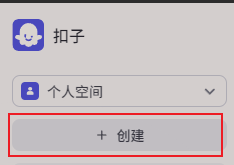
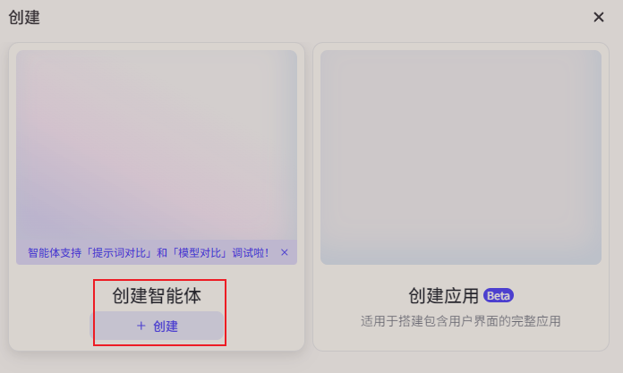
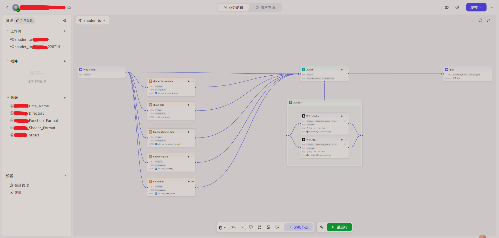

***

# coze ai agent 学习记录

>现在各个ai平台都推出了自己的agent内容，本质上是依托于大模型，使用低代码完成某些指定任务。

## Coze 介绍

### coze是开源的，可以完成本地部署
开源版本：[https://github.com/coze-dev/coze-studio.git](https://github.com/coze-dev/coze-studio.git)


[开源版本部署流程](https://github.com/coze-dev/coze-studio/wiki/2.-%E5%BF%AB%E9%80%9F%E5%BC%80%E5%A7%8B)

# 快速开始
>本文基于国内平台测试开发

国内扣子：[https://www.coze.cn/home](https://www.coze.cn/home)


扣子文档:[https://www.coze.cn/open/docs/guides](https://www.coze.cn/open/docs/guides)

1. 安装SDK(需要最低python-3.8.2)：pip install cozepy
2. 发布：将创建的工作流发布为API
3. 执行工作流：[文档](https://www.coze.cn/open/docs/developer_guides/workflow_run)
4. 测试代码:


# 创建流程






[](../../assets/img/coze_ai_agent/work_04.png){:target="_blank" rel="noopener noreferrer"}

在搭建工作流界面，我们创建出我们需要的具体业务流程，这个业务的数据处理主体可以是大模型，这样就实现了智能体处理。

- 技能
    - 给予大模型执行某些功能的工具插件，比如读取文本或读取图像信息。
- 输入
    - 从开始的输入或流程中处理后的内容，链接给大模型并指定输入来源和名称
- 系统提示词
    - 这是赋予大模型具体职责的模块
    - 
- 用户提示词
    - 如果需要可以填充，用于大模型执行、对话、数据查询等
- 输出 
    - 将所需的内容设置输出格式

因为我们要使用api获取工作流的结果，所以不能链接到输出节点，因为输出节点用作页面展示的。


我们需要输出到结束。

```python
import os
import requests
import json
import tkinter as tk
from tkinter import filedialog, scrolledtext, messagebox
import threading
import queue

# 执行coze请求并返回结果的代码
COZE_TOKEN = "pat_xxx"
WORKFLOW_ID = "number"
COZE_RUN_URL = "https://api.coze.cn/v1/workflow/run"
# 尝试过不输入UID，但是结果返回是错误代码，可能格式不正确？
UID_ID = "number"
USER_NAME = "name string"
# 鉴权
headers = {
    "Content-Type": "application/json",
    "Authorization": f"Bearer {COZE_TOKEN}"
}
# 工作流
payload = {
    "workflow_id": workflow_id,
    "parameters":{
        "user_id": UID_ID,
        "user_name": USER_NAME,
        "input": inputs_array
    }
}
try:
    # 设置超时300钟
    response = requests.post(COZE_RUN_URL, headers=headers, json=payload, timeout=300)
    response.raise_for_status() 
    result = response.json() 
    return result
except requests.exceptions.HTTPError as http_err:
    error_message = f"HTTP 错误: {http_err}\n响应内容: {response.text}"
    print(error_message)
    return {"error": error_message}
except requests.exceptions.RequestException as req_err:
    error_message = f"请求失败: {req_err}"
    print(error_message)
    return {"error": error_message}
except Exception as e:
    error_message = f"发生未知错误: {e}"
    print(error_message)
    return {"error": error_message}

```

因为本测试流程使用到是json格式输出，所以示例代码中使用的也是json

# 代码转译格式-结论
>转译function为指定格式正确率高，结果较为稳定。但是function的input 与 output有时会转译错误,无法很好的理解上下文中function实际的输入是谁。
转译shader为指定格式正确率底，表现为知识库数据的理解不到位，角色设置的内容不能被正确理解。
>想要提高正确率，就需要增加输入的提示词内容，但是提示词有单次数据知识库string字符限制（5000），可多次拼接数据知识（但是顺序可能是乱的。）然而效果依然一般，模型角色不能很好的理解shader的格式嵌套模式与定义类型（即便已经给予类型说明）
>本质是通过自动化填入转译源文件与转译规范，输出转译结果并保存的流程。但是ai模型执行多任务不稳定，需要另一个模型监督（这会导致响应时间太长，很容易超过设置的300钟），改为双模型协作各自输出单一任务结果（每增加一个模型耗时增加2倍左右'还与输入内容长短有关'）。

# 关于收费
>使用字节的大模型或api调用在线工作流需要消耗扣子点数

***

[back](../../coding-page.html)