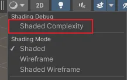
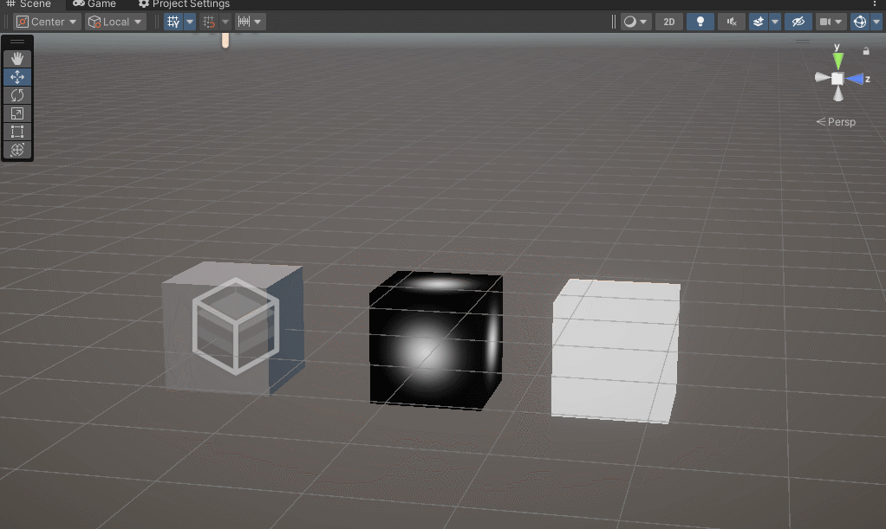

# 自定义 Scene View 工具栏 Draw Mode

***







unity 在URP中完善了Camera Replace Shader的重绘方式，可以比较优雅的使用相机debug渲染模式了（以前17.x版本切到这个模式，切程序会导致自动编译工程为built-in）

```c#

using System.Collections.Generic;
using UnityEditor;
using UnityEngine;

public class ShaderComplexityEditor : ScriptableSingleton<ShaderComplexityEditor>
{
    // 单例初始化调用
    [InitializeOnLoadMethod]
    static void Initialize() => _ = instance;

#region 属性
    private bool m_needsUpdate = true;
    private const string k_Name = "Shaded Complexity";
    const string k_Section = "Shading Debug";
    private Shader m_RelpacementShader;// Debug 显示的shader
    private Dictionary<SceneView, bool> m_Active = new Dictionary<SceneView, bool>();
 
    private GUIStyle m_RightAlignedLabelStyle;
#endregion
    
    void OnEnable()
    {
        //添加一个渲染分区与按钮
        SceneView.AddCameraMode(k_Name, k_Section);
        
        SceneView.duringSceneGui += OnSceneGUI;
        m_RelpacementShader = Shader.Find("Hidden/ShaderComplexity");
        
        m_needsUpdate = true;
    }
    
    private void OnDisable()
    {
        SceneView.duringSceneGui -= OnSceneGUI;
        ShaderComplexityDatabase.ClearAllPropertyBlocks();
    }

    private void OnSceneGUI(SceneView view)
    {
        if (Event.current.type != EventType.Repaint)return;

        bool wasActive = m_Active.ContainsKey(view) && m_Active[view];
        var isActive = view.cameraMode.drawMode == DrawCameraMode.UserDefined
                       && view.cameraMode.name == k_Name
                       && view.cameraMode.section == k_Section;
        
        if (wasActive != isActive)
        {
            if (isActive)
            {
                // 开启视图
                view.SetSceneViewShaderReplace(m_RelpacementShader, string.Empty);
                m_needsUpdate = true; 
            }
            else
            {
                // 关闭视图
                view.SetSceneViewShaderReplace(null, null);
                ShaderComplexityDatabase.ClearAllPropertyBlocks();
            }
            m_Active[view] = isActive; // 更新状态记录
        }

        // 数据更新设置
        if (isActive)
        {
            if (ShaderComplexityDatabase.IsDataDirty)
            {
                m_needsUpdate = true;
            }

            // 这里是希望切换渲染状态与渲染数据更新更新分离，不要一直设置replace
            if(m_needsUpdate && m_RelpacementShader )
            {
                // 设置Debug Shader显示
                // 如果debug的模式需要逐材质设置属性，那还是只能使用不太优雅的全场景遍历形式.
                ShaderComplexityDatabase.UpdateAllRendererBlocks();
                
                m_needsUpdate = false; // 更新完成，重置标记
                ShaderComplexityDatabase.MarkAsClean();
            }
            
            
        }
    }
}
```


***

[back](../../coding-page.html)