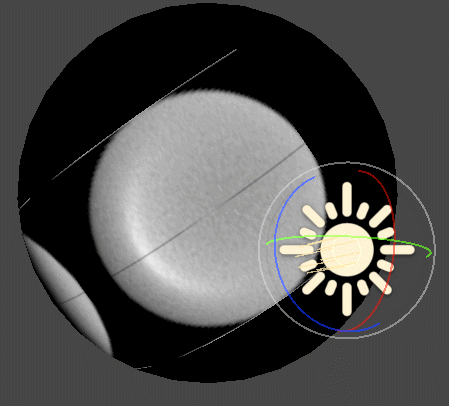

# 眼球焦散调研

***
## 序列帧形式

|||

*思路来源于csdn的一位老哥分享到的ue中截取的贴图，文章找不到了,对贴图排列为2行,原方案为1行*

```c#

float Remap(half value, half4 remap) { 
    return remap.z + (value - remap.x) * (remap.w - remap.z) / (remap.y - remap.x); 
}
void Flipbook(float2 UV, float Width, float Height, float Tile, float2 Invert, out float2 Out)
{
    Tile = fmod(Tile, Width * Height);
    float2 tileCount = float2(1.0, 1.0) / float2(Width, Height);
    float tileY = abs(Invert.y * Height - (floor(Tile * tileCount.x) + Invert.y * 1));
    float tileX = abs(Invert.x * Width - ((Tile - Width * floor(Tile * tileCount.x)) + Invert.x * 1));
    Out = (UV + float2(tileX, tileY)) * tileCount;
}
// 这个旋转只是为了匹配朝向,因为眼球的绑定可能各式各样
half3x3 rotateX(half angle)
{
    angle = radians(angle);
    half3x3 rotateMartix = half3x3( half3(1,0,0),   
                                    half3(0,cos(angle),-sin(angle)),
                                    half3(0,sin(angle),cos(angle))
                                    );
    return rotateMartix;
}

// 这只是一个横向播放的方案
half GetIrisSSS(float2 uv)
{
    float3 lightDir = _MainLightPosition.xyz;
    float3 front = unity_ObjectToWorld._12_22_32;
    front = normalize(mul(rotateX(90), front));//3dmax导出 z轴向上 x-90
    float3 right = unity_ObjectToWorld._13_23_33;
    float FrontL = dot(front.xyz, lightDir.xyz);
    float RightL = dot(right.xz, lightDir.xz);

    half f = Remap(saturate(1 - abs(RightL)), half4(0,1,0,5));
    float fps = fmod(f, 6);
    int tile = floor(fps);
    uv = RightL < 0 ? uv : float2(1 - uv.x, uv.y);
    Flipbook(uv, 3, 2, tile, half2(0,1), uv);
    
    half sss = SAMPLE_TEXTURE2D(_EnvMap, sampler_EnvMap, uv).a * saturate(FrontL);
   
    return saturate(sss);
}
```

## 旋转贴图形式


*这个就简单多了只进行了贴图uv旋转*

```c#
//同样只是横向响应
half SampleIrisSSS(float2 uv)
{
    float3 front = unity_ObjectToWorld._12_22_32;
    front = normalize(mul(rotateX(90), front));//3dmax导出 z轴向上 x-90
    float FrontL = dot(front.xyz, _MainLightPosition.xyz);
    
    float3 lightDir = SafeNormalize(-_MainLightPosition.xyz);
    half s = sin(lightDir.x);
    half c = cos(lightDir.x);
    uv = mul(uv - float2(0.5,0.5), float2x2(c, -s, s, c)) + float2(0.5,0.5);
    half sss = SAMPLE_TEXTURE2D(_EnvMap, sampler_EnvMap, uv).a * saturate(FrontL);
    return sss;
}
```

## 3D Texture 预生成形式

|  | |

*这里从举行光照区域像自定义的椭球体发射光线进行求交的过程,该方案来自unity hdrp*


随机光线通过与角膜表面相交以后，根据菲涅尔方程区分反射和折射，光线每次传播都会衰减，在内部如果光线最终到达了虹膜则会累计到buffer结果里
（一旦光线击中虹膜，虹膜的贡献权重通常与光线和虹膜表面的夹角有关，此时虹膜被描述为一个平面）
假设角膜是左右对称的，从而将一侧的采样结果镜像到另一侧，用一半的计算量得到完整的结果。


**compute shader**
```c#
#include "Packages/com.unity.render-pipelines.core/ShaderLibrary/Common.hlsl"

// #pragma enable_d3d11_debug_symbols

#pragma kernel SampleCaustic
#pragma kernel CopyToLUT
#pragma kernel ClearBuffer

#define INV2PI 1.570796
#define INV4PI 0.785398
#define T_RAY_MISSED 1e9f
#define CORNEA_RADIUS 1

#define CORNEA_FLATTENING _CorneaFlatteningFactor
#define LIGHT_LUMINOUS_FLUX _LightLuminousFlux
#define DISTANCE_EPSILON 1e-3
#define CORNEA_IOR 1.376f

int _OutputWidth;
int _OutputHeight;
int _OutputDepth;
int _OutputSlice;
int _UseCorneaSymmetryMirroring;
float _ExtraScleraMargin;

float _LightWidth;
float _LightHeight;
float _LightDistance;
float _LightLuminousFlux;
float _LightGrazingAngleCos;

int _CorneaApproxPrimitive;
float _CorneaFlatteningFactor;
float _CorneaPowerFactor;

//4 uncorrelating random numbers,[0, 1]
StructuredBuffer<float4> _RandomNumbers;
int _RandCount;
int _NumberOfSamplesAccumulated;

SAMPLER (s_linear_clamp_sampler);

RWByteAddressBuffer _GeneratedSamplesBuffer;

RW_TEXTURE3D(float, _OutputLutTex);
RW_TEXTURE2D(float, _CopyOutputPreviewTex);

//from: https://seblagarde.wordpress.com/2013/04/29/memo-on-fresnel-equations/
float fresnelDiel(float eta, float cosTheta)
{
    float c = saturate(cosTheta);
    float temp = eta * eta + c * c - 1.f;

    if (temp < 0.f)
        return 1.f;
    else
    {
        float g = sqrt(temp);
        return 0.5f * pow((g - c) / max(g + c, 0.00001f), 2) *
            (1 + pow(((g + c) * c - 1.f) / ((g - c) * c + 1.f), 2));
    }
}

float ApplyExtraMargin(float u)
{
    u *= 1.f - _ExtraScleraMargin;
    u += _ExtraScleraMargin;
    return u;
}

float RemoveExtraMargin(float u)
{
    u -= _ExtraScleraMargin;
    u /= 1.f - _ExtraScleraMargin;
    return u;
}

float CalculateLightAngleCos()
{
    float lightPositionSlice = float(_OutputSlice) / (_OutputDepth - 1);
    float from = 1.f;
    float to = _LightGrazingAngleCos;
    float lightAngleCos = lerp(from, to, lightPositionSlice);
    return lightAngleCos;
}

float3 CalculateLightCenterDir(float lightAngleCos)
{
    float lightAngleSin = sqrt(1.f - lightAngleCos * lightAngleCos);

    float3 lightCenterDir = float3(0.0f, lightAngleCos, -lightAngleSin);
    return lightCenterDir;
}


void CalculateLightCornerPoints(float lightAngleCos, out float3 leftBot, out float3 rightBot, out float3 leftTop, out float3 rightTop)
{
    float lightHalfWidth = _LightWidth * 0.5f;
    float lightHalfHeight = _LightHeight * 0.5f;
    float lightDistance = _LightDistance;

    float3 lightCenterDir = CalculateLightCenterDir(lightAngleCos);

    float3 axisX = float3(1.f, 0.0f, 0.0f);
    float3 axisZ = lightCenterDir;
    float3 axisY = cross(axisX, axisZ);

    float3 lightCenter = axisZ * lightDistance;

    leftBot = lightCenter - lightHalfWidth * axisX - lightHalfHeight * axisY;
    rightBot = lightCenter + lightHalfWidth * axisX - lightHalfHeight * axisY;
    leftTop = lightCenter - lightHalfWidth * axisX + lightHalfHeight * axisY;
    rightTop = lightCenter + lightHalfWidth * axisX + lightHalfHeight * axisY;

}

void SamplePointOnLight(float2 rand, out float3 pointOnLight)
{
    float3 lb;
    float3 rb;
    float3 lt;
    float3 rt;

    float lightAngleCos = CalculateLightAngleCos();
    CalculateLightCornerPoints(lightAngleCos, lb, rb, lt, rt);
    pointOnLight = lerp(lerp(lb, rb, rand.x), lerp(lt, rt, rand.x), rand.y);
}


void SamplePointOnCornea(float2 rand, out float3 pointOnCornea)
{
    float y = rand.x;
    float r = sqrt(max(0, 1.f - y * y));
    float phi = 2 * PI * rand.y;

    pointOnCornea = float3(r * cos(phi), y, r * sin(phi)) * CORNEA_RADIUS;
    pointOnCornea.y *= CORNEA_FLATTENING;
}


void GenerateRayFromLightToCornea(float4 rand, out float3 pos, out float3 dir)
{
    float3 pointOnLight;
    float3 pointOnCornea;

    SamplePointOnLight(rand.xy, pointOnLight);
    SamplePointOnCornea(rand.zw, pointOnCornea);
    float3 lightToCornea = pointOnCornea - pointOnLight;
    float3 rayDir = normalize(lightToCornea);

    pos = pointOnLight;
    dir = rayDir;
}

float RaySphereIntersect(float3 sphereC, float sphereRad, float3 pos, float3 dir)
{
    // geometric solution
    float3 postoSphere = sphereC - pos;
    float d = dot(dir, postoSphere);

    float d2 = dot(postoSphere, postoSphere) - d * d;
    if (d2 > sphereRad * sphereRad)
        return T_RAY_MISSED;
    else
    {

        float s = sqrt(sphereRad * sphereRad - d2);
        float t1 = d - s;
        float t2 = d + s;

        float t = T_RAY_MISSED;

        if (t1 >= 0)
        {
            t = t1;
        }

        if (t2 >= 0 && t2 < t)
        {
            t = t2;
        }

        return t;
    }
}

float EvaluateCorneaHeightField(float2 xy)
{
    if (_CorneaApproxPrimitive == 0)
    {
        //sine approx
        float r = saturate(length(xy) / CORNEA_RADIUS);
        return PositivePow(sin(r * PI * 0.5f + PI * 0.5f), _CorneaPowerFactor) * CORNEA_RADIUS * CORNEA_FLATTENING;
    }
    else
    {
        //sphere
        float r = length(xy) / CORNEA_RADIUS;
        return r > 1.f ? 0.f : pow(sqrt(1 - r * r), _CorneaPowerFactor) * CORNEA_RADIUS * CORNEA_FLATTENING;
    }
}


float3 GetCorneaNormal(float3 pos)
{
    //return normalize(pos);
    float2 xy = pos.xz;

    //normal from central finite differences
    const float epsilon = 0.0001f;
    float x0 = EvaluateCorneaHeightField(xy + float2(-epsilon, 0.f));
    float x1 = EvaluateCorneaHeightField(xy + float2(epsilon, 0.f));

    float y0 = EvaluateCorneaHeightField(xy + float2(0.f, -epsilon));
    float y1 = EvaluateCorneaHeightField(xy + float2(0.f, epsilon));

    float3 l = float3(xy.x - epsilon, x0, xy.y);
    float3 r = float3(xy.x + epsilon, x1, xy.y);

    float3 b = float3(xy.x, y0, xy.y - epsilon);
    float3 t = float3(xy.x, y1, xy.y + epsilon);

    return normalize(cross(r - l, b - t));
}

float RayIntersectCornea(float3 pos, float3 dir)
{
    float sphereT = RaySphereIntersect(float3(0.0f, 0.0f, 0.0f), CORNEA_RADIUS, pos, dir);

    if (sphereT == T_RAY_MISSED)
    {
        return T_RAY_MISSED;
    }
    else
    {

        if ((pos + dir * sphereT).y < 0)
        {
            return T_RAY_MISSED;
        }
        else
        {
            //walk heightfield (simple function for now) and check for interaction
            float rayStep = DISTANCE_EPSILON;
            float distanceEpsilon = DISTANCE_EPSILON;
            float t = sphereT;
            while (true)
            {
                float3 currentPos = pos + t * dir;

                if (currentPos.y < 0)
                    break;

                float height = EvaluateCorneaHeightField(currentPos.xz);
                if (abs(height - currentPos.y) < distanceEpsilon)
                {
                    //TODO: do more accurate hit pos between this and previous pos. For now just return this
                    return t;
                }

                t += rayStep;

                if (dot(currentPos, currentPos) > CORNEA_RADIUS * CORNEA_RADIUS)
                {
                    break;
                }
            }

            return T_RAY_MISSED;
        }
    }
}

bool EvaluateAndSampleRayCorneaIntersection(float rand, float3 rayPos, float3 rayDir, bool insideCornea, out float3 newDir,
                                            out float weight)
{
    float corneaIOR = CORNEA_IOR;

    bool isInsideCornea = insideCornea;

    float3 corneaNormal = GetCorneaNormal(rayPos);
    //make sure the normal points towards the ray
    if (dot(rayDir, corneaNormal) > 0)
    {
        corneaNormal = -corneaNormal;
    }

    float cosTheta = dot(corneaNormal, -rayDir);
    float eta = isInsideCornea ? 1.f / corneaIOR : corneaIOR;

    float f = fresnelDiel(eta, cosTheta);

    float w = saturate(dot(-rayDir, corneaNormal));

    //cornea is assumed to be completely smooth so ignoring shadowing/masking and NDF, leaving only fresnel, jacobian and normalization (GGX)
    if (f < rand)
    {
        newDir = refract(rayDir, corneaNormal, 1.f / eta);

        float3 hVec = normalize(-rayDir + newDir * eta);
        if (eta > 1.f)
        {
            hVec *= -1.f;
        }

        float OdotH = saturate(dot(-rayDir, hVec));
        float IdotH = abs(dot(newDir, hVec));
        float denom = OdotH + eta * IdotH;
        denom *= denom;
        float j = eta * eta * IdotH / max(denom, 1e-6f);

        w *= OdotH * j / max(abs(dot(newDir, corneaNormal) * dot(corneaNormal, -rayDir)), 1e-4f);

        isInsideCornea = !isInsideCornea;
    }
    else
    {
        newDir = reflect(rayDir, corneaNormal);
        w *= 1.f / max(4.f * dot(newDir, corneaNormal) * dot(corneaNormal, -rayDir), 1e-4f);
    }

    weight = w;
    return isInsideCornea;
}

float RayIntersectIris(float3 pos, float3 dir)
{
    const float3 irisNormal = float3(0.0f, 1.f, 0.0);

    //ray-plane
    float d = dot(-irisNormal, dir);

    float res = T_RAY_MISSED;
    if (d > 1e-6)
    {
        float t = dot(pos, irisNormal) / d;
        if (t >= 0)
        {

            res = t;
        }
    }

    return res;
}

float EvaluateIrisIntersection(float3 rayDir)
{
    const float3 irisNormal = float3(0.0f, 1.f, 0.0);
    return saturate(dot(-rayDir, irisNormal));
}


bool EvaluateSample(int randInd, out float weight, out float2 locationXZ)
{
    float3 rayPos;
    float3 rayDir;

    float4 rand = _RandomNumbers[randInd];

    GenerateRayFromLightToCornea(rand, rayPos, rayDir);

    bool rayHit = true;
    bool isInsideCornea = false;
    float w = 1.f;

    int randOffset = 1;

    for (uint i = 0; i < 8; ++i)
    {
        float t = RayIntersectCornea(rayPos, rayDir);

        bool irisHit = false;

        if (isInsideCornea)
        {
            float tIris = RayIntersectIris(rayPos, rayDir);
            if (tIris != T_RAY_MISSED && tIris < t)
            {
                //iris hit
                t = tIris;
                irisHit = true;
            }
        }

        if (t == T_RAY_MISSED)
        {
            //ray escaped, we're done
            w = 0.f;
            rayHit = false;
            break;
        }

        rayPos = rayPos + rayDir * t;

        if (!irisHit)
        {
            float3 newDir;
            float weight;

            float rand2 = _RandomNumbers[randInd + randOffset++].x;

            isInsideCornea = EvaluateAndSampleRayCorneaIntersection(rand2, rayPos, rayDir, isInsideCornea, newDir, weight);

            w *= weight;
            rayDir = newDir;

            rayPos += newDir * 1e-9;
        }
        else
        {
            w *= EvaluateIrisIntersection(rayDir);
        }


        if (irisHit || w < 1e-9f)
        {
            break;
        }
    }

    weight = saturate(w);
    locationXZ = rayPos.xz;

    return rayHit;
}

float RefractLightAngle(float lightAngleCos, float3 normal)
{
    float lightAngleSin = sqrt(1.f - lightAngleCos * lightAngleCos);
    float3 lightCenterDir = float3(0.0f, lightAngleCos, -lightAngleSin);

    float3 refractL = -refract(-lightCenterDir, normal, 1.0 / CORNEA_IOR);

    return dot(float3(0.0f, 1.f, 0.0f), refractL);
}

int SampleTexelLocationToByteAddressBufferLocation(int2 texelLocation)
{
    return (texelLocation.x + texelLocation.y * _OutputWidth) * 4;
}

float CalculateFinalLUTValue(float samplesSum)
{
    float samplesAccumulatedInv = 1.f / float(_NumberOfSamplesAccumulated);
    if(_UseCorneaSymmetryMirroring)
    {
        samplesAccumulatedInv *= 0.5f;
    }

    //we just divide the light flux to sample count amount of particles which we assume to be emitted to all directions uniformly, so just need to account for actually always sampling directions towards the light, ie. solid angle projected by light (approximate).
    //In reality we should be calculating the solid angle of the cornea projected on light but we are doing it other way around (light projected on hemisphere aligned to cornea facing towards the light).
    //we don' care that this is not accurate, since the LUT is just used as a heuristic multiplier to get the caustic shape (the intensity is somewhat arbitrary and is tuned by parameters when applying the LUT values)
    float area = _LightWidth * _LightHeight;
    //we assume that the hemisphere we are calculating the solid angle against is always aligned to face the light
    float dotAbsCL = 1.f;
    float solidAngle = ( dotAbsCL * area ) / (_LightDistance * _LightDistance);

    float avgWeight = samplesSum * samplesAccumulatedInv;
    float illuminance = avgWeight * solidAngle * LIGHT_LUMINOUS_FLUX * PI;

    return illuminance;
}

void StoreSample(float2 locationUV, float weight)
{
    uint2 s = uint2(locationUV.x * _OutputWidth, locationUV.y * _OutputHeight);
    int bufferLoc = SampleTexelLocationToByteAddressBufferLocation(s);

    [allow_uav_condition]
    while (true)
    {
        uint origValue = _GeneratedSamplesBuffer.Load(bufferLoc);
        float origSample = asfloat(origValue);
        float newSample = origSample + weight;
        uint oldVal;
        _GeneratedSamplesBuffer.InterlockedCompareExchange(bufferLoc, origValue, asuint(newSample), oldVal);
        if (oldVal == origValue)
            break;
    }
}

[numthreads(64, 1, 1)]
void SampleCaustic(uint dispatchThreadId : SV_DispatchThreadID)
{
    int randInd = dispatchThreadId;;

    float2 sampleLocationXZ;
    float weight;

    if (EvaluateSample(randInd, weight, sampleLocationXZ))
    {
        //convert from cornea centric 3D space to uv space
        float2 sampleLocationUV = float2(-sampleLocationXZ.y, sampleLocationXZ.x) / (CORNEA_RADIUS);
        if (_UseCorneaSymmetryMirroring != 0)
        {
            sampleLocationUV.y = abs(sampleLocationUV.y) * 2.f - 1.f;
        }
        sampleLocationUV = sampleLocationUV * 0.5f + 0.5f;

        sampleLocationUV.x = ApplyExtraMargin(sampleLocationUV.x);

        if(sampleLocationUV.x > 0 && sampleLocationUV.x < 1 && sampleLocationUV.y > 0 && sampleLocationUV.y < 1)
        {
            StoreSample(sampleLocationUV, weight);
        }
    }
}

[numthreads(64, 1, 1)]
void ClearBuffer(uint dispatchThreadId : SV_DispatchThreadID)
{
    int entries = _OutputWidth * _OutputHeight;
    if (dispatchThreadId < uint(entries))
        _GeneratedSamplesBuffer.Store(dispatchThreadId * 4, asuint(0.0f));
}


[numthreads(8, 8, 1)]
void CopyToLUT(uint2 dispatchThreadId : SV_DispatchThreadID)
{
    if (dispatchThreadId.x < uint(_OutputWidth) && dispatchThreadId.y < uint(_OutputHeight))
    {
        int bufferLoc = SampleTexelLocationToByteAddressBufferLocation(dispatchThreadId.xy);
        float samples = asfloat(_GeneratedSamplesBuffer.Load(bufferLoc));
        uint3 lutLoc = uint3(dispatchThreadId.x, dispatchThreadId.y, _OutputSlice);
        
        _OutputLutTex[lutLoc] = CalculateFinalLUTValue(samples);
    }
}

```

**调度的代码也来自hdrp**

```c#
using Unity.Collections;
using UnityEditor;
using UnityEngine;
using UnityEngine.Experimental.Rendering;
using UnityEngine.Rendering;

public class EyeCausticLUTGenerator
{
    private static EyeCausticLUTGenerator s_Instance;

    public static EyeCausticLUTGenerator Instance
    {
        get
        {
            if(s_Instance == null)
                s_Instance = new EyeCausticLUTGenerator();
            return s_Instance; 
        }
    }

    static class Uniforms
        {
            internal static int _OutputWidth = Shader.PropertyToID("_OutputWidth");
            internal static int _OutputHeight = Shader.PropertyToID("_OutputHeight");
            internal static int _OutputDepth = Shader.PropertyToID("_OutputDepth");
            internal static int _OutputSlice = Shader.PropertyToID("_OutputSlice");
            internal static int _UseCorneaSymmetryMirroring = Shader.PropertyToID("_UseCorneaSymmetryMirroring");
            internal static int _ExtraScleraMargin = Shader.PropertyToID("_ExtraScleraMargin");

            internal static int _LightWidth = Shader.PropertyToID("_LightWidth");
            internal static int _LightHeight = Shader.PropertyToID("_LightHeight");
            internal static int _LightDistance = Shader.PropertyToID("_LightDistance");

            internal static int _LightLuminousFlux = Shader.PropertyToID("_LightLuminousFlux");
            internal static int _LightGrazingAngleCos = Shader.PropertyToID("_LightGrazingAngleCos");

            internal static int _CorneaFlatteningFactor = Shader.PropertyToID("_CorneaFlatteningFactor");
            internal static int _CorneaApproxPrimitive = Shader.PropertyToID("_CorneaApproxPrimitive");
            internal static int _CorneaPowerFactor = Shader.PropertyToID("_CorneaPowerFactor");

            internal static int _RandomNumbers = Shader.PropertyToID("_RandomNumbers");

            internal static int _NumberOfSamplesAccumulated = Shader.PropertyToID("_NumberOfSamplesAccumulated");

            internal static int _GeneratedSamplesBuffer = Shader.PropertyToID("_GeneratedSamplesBuffer");

            internal static int _OutputLutTex = Shader.PropertyToID("_OutputLutTex");

            public static readonly int _PreIntegratedEyeCaustic = Shader.PropertyToID("_PreIntegratedEyeCaustic");
        }

        enum CorneaApproximationPrimitive
        {
            Sine = 0,
            Sphere = 1
        }

        private float lightSize = 10.0f;
        private float lightLuminousFlux = 12000;
        private float lightDipBelowHorizonDegrees = 30.0f;
        private float lightDistance = 10.0f;
        private float corneaFlatteningFactor = 0.7f;
        private float corneaPowerFactor = 1.5f;
        private CorneaApproximationPrimitive selectedCorneaApproxPrim = CorneaApproximationPrimitive.Sphere;

        private int lutWidth = 128;
        private int lutHeight = 32;
        private int lutDepth = 16;
        private bool useCorneaSymmetryMirroring = true;
        private float lutExtraScleraMargin = 0.15f;

        private RenderTexture generatedLUT;

        private ComputeBuffer generatedLutStagingBuffer;
        private ComputeBuffer randomSamplesBuffer;

        private const int LUT_GEN_KERNEL_SIZE = 64;
        private const int LUT_GEN_NUMBER_OF_DISPATCHES = 512 * 32;
        private const int LUT_GEN_SAMPLES_PER_SLICE = LUT_GEN_NUMBER_OF_DISPATCHES * LUT_GEN_KERNEL_SIZE;

        private static ComputeShader s_Shader;
        private static int[] s_Kernels = new int[3];

        private void CreateLUTGenResources()
        {
            if (s_Shader == null)
            {
#if UNITY_EDITOR
                s_Shader = AssetDatabase.LoadAssetAtPath<ComputeShader>("Assets/Eye/EyeCausticLUT.compute");
#endif
            }

            if (s_Shader == null)
            {
                Debug.LogError("Compute Shader 'EyeCausticLUT.compute' 未能加载! 请检查路径是否为 'Assets/Eye/EyeCausticLUT.compute'");
                return;
            }

            s_Kernels[0] = s_Shader.FindKernel("SampleCaustic");
            s_Kernels[1] = s_Shader.FindKernel("CopyToLUT");
            s_Kernels[2] = s_Shader.FindKernel("ClearBuffer");
            
            RenderTextureDescriptor volumeDesc = new RenderTextureDescriptor()
            {
                dimension = TextureDimension.Tex3D,
                width = lutWidth,
                height = lutHeight,
                volumeDepth = lutDepth,
                graphicsFormat = GraphicsFormat.R16_SFloat,
                enableRandomWrite = true,
                msaaSamples = 1,
            };

            if (generatedLUT != null)
            {
                generatedLUT.Release();
            }

            generatedLUT = new RenderTexture(volumeDesc)
            {
                wrapMode = TextureWrapMode.Clamp, hideFlags = HideFlags.HideAndDontSave, name = "Caustic LUT"
            };
            generatedLUT.enableRandomWrite = true;
            generatedLUT.Create();

            generatedLutStagingBuffer = new ComputeBuffer(lutWidth * lutHeight, 4, ComputeBufferType.Raw);
            generatedLutStagingBuffer.name = "Caustic LUT Staging";
            randomSamplesBuffer = new ComputeBuffer(LUT_GEN_SAMPLES_PER_SLICE, sizeof(float) * 4, ComputeBufferType.Default);
        }

        private void FreeLUTGenResources()
        {
            randomSamplesBuffer.Release();
            generatedLutStagingBuffer.Release();
        }

        private void GenerateLUT()
        {
            for (int i = 0; i != lutDepth; ++i)
            {
                ClearStaging();
                GenerateLUTForSlice(i);
                CopyFromStagingToLUT(lutDepth - i - 1);
            }
            
        }

        private void GenerateLUTForSlice(int currentDepthSlice)
        {
            int sampleCount = LUT_GEN_SAMPLES_PER_SLICE;

            NativeArray<Vector4> samples = new NativeArray<Vector4>(sampleCount, Allocator.Temp,
                NativeArrayOptions.UninitializedMemory);


            for (int i = 0; i < sampleCount; ++i)
            {
                float a = HaltonSequence.Get(i, 2);
                float b = HaltonSequence.Get(i, 3);
                float c = HaltonSequence.Get(i, 5);
                float d = HaltonSequence.Get(i, 7);

                Vector4 s = new Vector4(a, b, c, d);
                samples[i] = s;
            }

            randomSamplesBuffer.SetData(samples);
            samples.Dispose();

            CommandBuffer cmd = CommandBufferPool.Get();
            int kernel = s_Kernels[0];

            cmd.SetComputeIntParam(s_Shader, Uniforms._OutputWidth, lutWidth);
            cmd.SetComputeIntParam(s_Shader, Uniforms._OutputHeight, lutHeight);
            cmd.SetComputeIntParam(s_Shader, Uniforms._OutputSlice, currentDepthSlice);
            cmd.SetComputeFloatParam(s_Shader, Uniforms._ExtraScleraMargin, lutExtraScleraMargin);
            cmd.SetComputeFloatParam(s_Shader, Uniforms._UseCorneaSymmetryMirroring, useCorneaSymmetryMirroring ? 1 : 0);

            cmd.SetComputeFloatParam(s_Shader, Uniforms._LightWidth, lightSize);
            cmd.SetComputeFloatParam(s_Shader, Uniforms._LightHeight, lightSize);
            cmd.SetComputeFloatParam(s_Shader, Uniforms._LightDistance, lightDistance);
            float cosGrazingAngle = Mathf.Cos(Mathf.PI * 0.5f + Mathf.Deg2Rad * lightDipBelowHorizonDegrees);
            cmd.SetComputeFloatParam(s_Shader, Uniforms._LightGrazingAngleCos, cosGrazingAngle );
            cmd.SetComputeFloatParam(s_Shader, Uniforms._LightLuminousFlux, lightLuminousFlux );

            cmd.SetComputeIntParam(s_Shader, Uniforms._CorneaApproxPrimitive, (int)selectedCorneaApproxPrim);
            cmd.SetComputeFloatParam(s_Shader, Uniforms._CorneaFlatteningFactor, corneaFlatteningFactor);
            cmd.SetComputeFloatParam(s_Shader, Uniforms._CorneaPowerFactor, corneaPowerFactor);

            cmd.SetComputeBufferParam(s_Shader, kernel, Uniforms._RandomNumbers, randomSamplesBuffer);

            cmd.SetComputeBufferParam(s_Shader, kernel, Uniforms._GeneratedSamplesBuffer, generatedLutStagingBuffer);

            cmd.DispatchCompute(s_Shader, kernel, LUT_GEN_NUMBER_OF_DISPATCHES, 1, 1);
            Graphics.ExecuteCommandBuffer(cmd);

            CommandBufferPool.Release(cmd);
        }

        void CopyFromStagingToLUT(int currentDepthSlice)
        {

            int sampleCount = LUT_GEN_SAMPLES_PER_SLICE;
            CommandBuffer cmd = CommandBufferPool.Get();
            int kernel = s_Kernels[1];

            cmd.SetComputeIntParam(s_Shader, Uniforms._OutputWidth, lutWidth);
            cmd.SetComputeIntParam(s_Shader, Uniforms._OutputHeight, lutHeight);
            cmd.SetComputeIntParam(s_Shader, Uniforms._OutputDepth, lutDepth);
            cmd.SetComputeIntParam(s_Shader, Uniforms._OutputSlice, currentDepthSlice);
            cmd.SetComputeIntParam(s_Shader, Uniforms._NumberOfSamplesAccumulated, sampleCount);

            cmd.SetComputeBufferParam(s_Shader, kernel, Uniforms._GeneratedSamplesBuffer, generatedLutStagingBuffer);
            cmd.SetComputeTextureParam(s_Shader, kernel, Uniforms._OutputLutTex, generatedLUT);

            cmd.DispatchCompute(s_Shader, kernel, (lutWidth + 7) / 8,
                (lutHeight + 7) / 8, 1);

            Graphics.ExecuteCommandBuffer(cmd);

            CommandBufferPool.Release(cmd);
        }

        void ClearStaging()
        {
            CommandBuffer cmd = CommandBufferPool.Get();
            int kernel = s_Kernels[2];

            int entries = lutWidth * lutHeight;

            cmd.SetComputeIntParam(s_Shader, Uniforms._OutputWidth, lutWidth);
            cmd.SetComputeIntParam(s_Shader, Uniforms._OutputHeight, lutHeight);

            cmd.SetComputeBufferParam(s_Shader, kernel, Uniforms._GeneratedSamplesBuffer, generatedLutStagingBuffer);

            cmd.DispatchCompute(s_Shader, kernel, (entries + 63) / 64, 1, 1);

            Graphics.ExecuteCommandBuffer(cmd);

            CommandBufferPool.Release(cmd);
        }
        
#if UNITY_EDITOR
    
        private void SaveLUTAsAsset()
        {
            if (generatedLUT == null)
            {
                Debug.LogError("Generated LUT is null. Cannot save.");
                return;
            }

            int width = generatedLUT.width;
            int height = generatedLUT.height;
            int depth = generatedLUT.volumeDepth;
            var format = generatedLUT.graphicsFormat;
            var textureFormat = TextureFormat.RFloat; 

            RenderTexture tempRT = RenderTexture.GetTemporary(width, height, 0, format);
            Texture2D tempTex2D = new Texture2D(width, height, textureFormat, false);
            
            // 创建一个足够大的数组来存储所有像素数据
            int slicePixelCount = width * height;
            Color[] allPixels = new Color[slicePixelCount * depth];

            for (int i = 0; i < depth; i++)
            {
                Graphics.CopyTexture(generatedLUT, i, 0, tempRT, 0, 0);
                RenderTexture.active = tempRT;

                tempTex2D.ReadPixels(new Rect(0, 0, width, height), 0, 0);
                tempTex2D.Apply(); // 应用更改

                Color[] slicePixels = tempTex2D.GetPixels();

                System.Array.Copy(slicePixels, 0, allPixels, i * slicePixelCount, slicePixelCount);
            }

            RenderTexture.active = null;
            RenderTexture.ReleaseTemporary(tempRT);
            Object.DestroyImmediate(tempTex2D);

            Texture3D lutAsset = new Texture3D(width, height, depth, textureFormat, false);
            lutAsset.SetPixels(allPixels);
            lutAsset.Apply(); // 应用 SetPixels

            string path = "Assets/Eye/PreIntegratedEyeCaustic.asset";
            AssetDatabase.CreateAsset(lutAsset, path);
            AssetDatabase.SaveAssets();
            AssetDatabase.Refresh();

            Debug.Log("Caustic LUT saved to: " + path);
        }
#endif
        // 这里做了保存修改，方便观察图上信息
        public void Create()
        {
            try
            {
                CreateLUTGenResources();
                GenerateLUT();
        
                GL.Flush();
                AsyncGPUReadback.WaitAllRequests();
        
                SaveLUTAsAsset();
            }
            finally
            {
                FreeLUTGenResources();
                Cleanup();
            }
        }

        internal void Cleanup()
        {
            if (generatedLUT != null)
            {
                generatedLUT.Release();
                generatedLUT = null;
            }
        }

        internal void Bind(CommandBuffer cmd)
        {
            cmd.SetGlobalTexture(Uniforms._PreIntegratedEyeCaustic, generatedLUT);
        }
}

```

**最后是测试shader**

```c#
Shader "Unlit/Eye_test"
{
    Properties
    {
        _Sclera ("Sclera Texture", 2D) = "white" {}
        _ScleraNormal ("Sclera Normal", 2D) = "bump" {}
        _Iris ("Iris Texture", 2D) = "white" {}
        _IrisNormal ("Iris Normal", 2D) = "bump" {}
        _LUT("LUT", 3D) = ""{}
        _Height("Height", Float) = 0.1
        irisRadius("irisRadius",float) = 0.5
    }
    SubShader
    {
        Tags { "RenderType"="Opaque" }
        LOD 100

        Pass
        {
            HLSLPROGRAM
            #pragma vertex vert
            #pragma fragment frag
            // make fog work
            #pragma multi_compile_fog

            #include "Packages/com.unity.render-pipelines.universal/ShaderLibrary/Lighting.hlsl"

            struct appdata
            {
                float4 vertex : POSITION;
                float2 uv : TEXCOORD0;
                float3 normal : NORMAL;
            };

            struct v2f
            {
                float2 uv : TEXCOORD0;
                float4 vertex : SV_POSITION;
                float3 lightPosOS : TEXCOORD1;
                float3 viewDirOS : TEXCOORD2;
                float3 positionWS : TEXCOORD3;
                float3 normalWS : TEXCOORD4;
                float3 posOS : TEXCOORD5;
            };

            sampler2D _Sclera;
            sampler2D _ScleraNormal;
            sampler2D _Iris;
            sampler2D _IrisNormal;
            TEXTURE3D(_LUT);
            SAMPLER(sampler_LUT);
            float4 _MainTex_ST;
            float _Height;
            float irisRadius;

            v2f vert (appdata v)
            {
                v2f o;
                o.vertex = TransformObjectToHClip(v.vertex);
                o.uv = v.uv;
                o.lightPosOS = TransformWorldToObject(_MainLightPosition);
                o.positionWS = TransformObjectToWorld(v.vertex);
                o.normalWS = TransformObjectToWorldNormal(v.normal);
                o.viewDirOS = TransformWorldToObjectDir(GetCameraPositionWS() - o.positionWS);
                o.posOS = v.vertex;
                return o;
            }

            // HDRP
            float ComputeCausticFromLUT(float2 irisPlanePosition, float irisHeight, float3 lightPosOS, float intensityMultiplier)
            {
                //these need to match with the values LUT was generated with
                float causticLutThetaMin = -0.5f; //LUT generated with last slice 30 degrees below horizon, ie. cos(pi * 0.5 + 30 * toRadians) == -0.5
                bool causticMirrorV = true;
                float causticScleraMargin = 0.15f;

                lightPosOS.z -= irisHeight;// 计算平面统一到虹膜位置

                float3 lightDirOS = normalize(lightPosOS);

                float2 xAxis = normalize(lightDirOS.xy); // 建立二维轴，指向光源在平面xy上的投影方向
                float2 yAxis = float2(-xAxis.y, xAxis.x); // 与xAxis垂直的轴向，构建二维坐标系

                float cosTheta = lightDirOS.z;

                float w = (cosTheta - causticLutThetaMin) / (1.f - causticLutThetaMin);

                //fadeout when the light moves past the last LUT slice
                float blendToBlack = lerp(1.f, 0.f, saturate(-w * 10.f));

                w = saturate(1.f - w);
                float2 uv = irisPlanePosition;// 初始化uv为虹膜表面

                //orient and map from [-1, 1] -> [0,1]
                uv = float2(dot(uv, xAxis), dot(uv, yAxis));// 从原始坐标系投影到光源坐标系中

                //caustic LUT has potentially mirrored V coordinate
                if(causticMirrorV)
                {
                    uv.y = abs(uv.y) * 2.f - 1.f; // y轴上镜像，因为3d texture只有一半内容
                }

                uv = uv * 0.5f + 0.5f;

                // margin at the U to have space for caustic hilight outside of cornea area
                uv.x *= 1.f - causticScleraMargin;
                uv.x += causticScleraMargin;

                float c = SAMPLE_TEXTURE3D_LOD(_LUT, sampler_LUT, float3(uv.x, uv.y, 1.f - w), 0).x * intensityMultiplier;
                //clamp borders to black (uv.x < 0 smoothstepped since we might not have given enough margin in LUT for the sclera hotspot to falloff. Capturing it completely would waste a lot of space in the LUT)
                float2 bc = (step(0, uv.y) * step(uv, 1));
                c *= bc.x * bc.y * smoothstep(-0.2f, 0.0f, uv.x);
                c *= blendToBlack;
                return c;
            }

            half4 frag (v2f i) : SV_Target
            {
                // sample the texture
                half4 col = tex2D(_Sclera, i.uv);
                half4 col2 = tex2D(_Iris, (i.uv-0.5) * 2 + 0.5);
                half mask = distance(i.uv, 0.5) < 0.25 ? 1 : 0;
                col = lerp(col, col2, mask);

                float ior = 1.376; // 眼睛的折射率
                float3 N = float3(0, 0, -1); // 假设模型是朝向-Z的球面
                // 在对象空间下计算折射后的视线方向
                float3 refractedViewDirOS = normalize(refract(-normalize(i.viewDirOS), N, 1.0 / ior));
                
                // 计算与虹膜平面的交点
                float irisPlaneOffset = 0.1; // 虹膜深度
                float t = max(i.posOS.z - irisPlaneOffset, 0.f) / max(-refractedViewDirOS.z, 1e-5f);
                float3 irisPositionOS = i.posOS + refractedViewDirOS * t;
                irisPositionOS.xy /= irisRadius;
                
                half caustic = ComputeCausticFromLUT(irisPositionOS, _Height, i.lightPosOS, 2);

                col.rgb = lerp(col.rgb, col.rgb * (1.0 + caustic), mask);
                return col;
            }
            ENDHLSL
        }
    }
}

```


***

[back](../../coding-page.html)