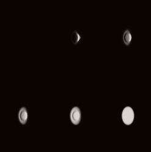
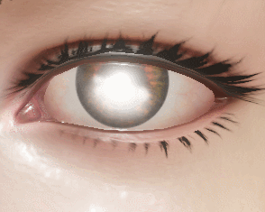
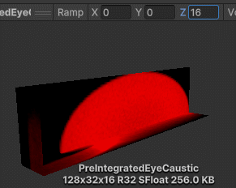

# 眼球焦散调研

***
## 序列帧形式

|||

*思路来源于csdn的一位老哥分享到的ue中截取的贴图，文章找不到了,对贴图排列为2行,原方案为1行*


## 旋转贴图形式


*这个就简单多了只进行了贴图uv旋转*


## 3D Texture 预生成形式

|  |  | |

*这里从举行光照区域像自定义的椭球体发射光线进行求交的过程,该方案来自unity hdrp*


随机光线通过与角膜表面相交以后，根据菲涅尔方程区分反射和折射，光线每次传播都会衰减，在内部如果光线最终到达了虹膜则会累计到buffer结果里
（一旦光线击中虹膜，虹膜的贡献权重通常与光线和虹膜表面的夹角有关，此时虹膜被描述为一个平面）
假设角膜是左右对称的，从而将一侧的采样结果镜像到另一侧，用一半的计算量得到完整的结果。


**预计算代码 EyeCausticLUT.cs**

**预计算shader EyeCausticLUTGen.compute**

**最后是测试shader**

```c#

irisPlanePosition = irisPositionOS.xy / bsdfData.irisRadius;
irisPlaneOffset;
float3 lightPosOS = TransformWorldToObjectDir(-lightData.forward) * 1000.f;

float ComputeCausticFromLUT(float2 irisPlanePosition, float irisHeight, float3 lightPosOS, float intensityMultiplier)
{
    //these need to match with the values LUT was generated with
    float causticLutThetaMin = -0.5f; //LUT generated with last slice 30 degrees below horizon, ie. cos(pi * 0.5 + 30 * toRadians) == -0.5
    bool causticMirrorV = true;
    float causticScleraMargin = 0.15f;

    lightPosOS.z -= irisHeight;

    float3 lightDirOS = normalize(lightPosOS);

    float2 xAxis = normalize(lightDirOS.xy);
    float2 yAxis = float2(-xAxis.y, xAxis.x);

    float cosTheta = lightDirOS.z;

    float w = (cosTheta - causticLutThetaMin) / (1.f - causticLutThetaMin);

    //fadeout when the light moves past the last LUT slice
    float blendToBlack = lerp(1.f, 0.f, saturate(-w * 10.f));

    w = saturate(1.f - w);
    float2 uv = irisPlanePosition;

    //orient and map from [-1, 1] -> [0,1]
    uv = float2(dot(uv, xAxis), dot(uv, yAxis));

    //caustic LUT has potentially mirrored V coordinate
    if(causticMirrorV)
    {
        uv.y = abs(uv.y) * 2.f - 1.f;
    }

    uv = uv * 0.5f + 0.5f;

    // margin at the U to have space for caustic hilight outside of cornea area
    uv.x *= 1.f - causticScleraMargin;
    uv.x += causticScleraMargin;

    float c = SAMPLE_TEXTURE3D_LOD(_PreIntegratedEyeCaustic, _CausticLUT_trilinear_clamp_sampler, float3(uv.x, uv.y,1.f - w), 0).x * intensityMultiplier;

    //clamp borders to black (uv.x < 0 smoothstepped since we might not have given enough margin in LUT for the sclera hotspot to falloff. Capturing it completely would waste a lot of space in the LUT)
    float2 bc = (step(0, uv.y) * step(uv, 1));
    c *= bc.x * bc.y * smoothstep(-0.2f, 0.0f, uv.x);
    c *= blendToBlack;
    return c;
}

float3 ApplyCausticToDiffuse(float3 diffuse, float causticIntensity, float corneaMask, float blend)
{
    return lerp(corneaMask, causticIntensity, blend) * diffuse;
}


//使用
float3 posOS = TransformWorldToObject(posInput.positionWS);
float3 refrOS = TransformWorldToObjectDir(refract(-V, N, 1.0 / bsdfData.IOR));

float t = max(posOS.z - bsdfData.irisPlaneOffset, 0.f) / max(-refrOS.z, 1e-5f);

float3 irisPositionOS = posOS + refrOS * t;
preLightData.irisPlanePosition = irisPositionOS.xy / bsdfData.irisRadius;

float3 lightPosOS = TransformWorldToObjectDir(-lightData.forward) * 1000.f;

float c = ComputeCausticFromLUT(preLightData.irisPlanePosition, bsdfData.irisPlaneOffset, lightPosOS, bsdfData.causticIntensity);
float3 caustic = ApplyCausticToDiffuse(dlIris.diffuse, c, bsdfData.mask.x, bsdfData.causticBlend);
diffuse = (1.f - bsdfData.mask.x) * dl.diffuse + caustic;

```


***

[back](../../coding-page.html)