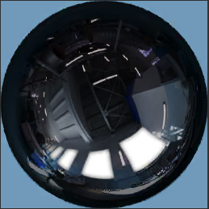
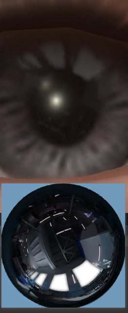
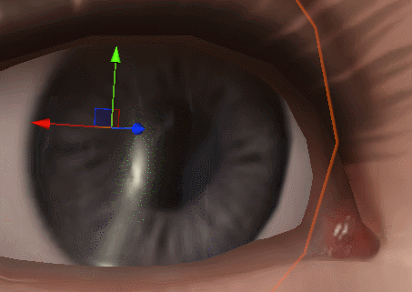
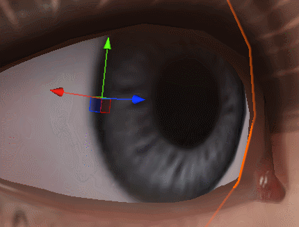
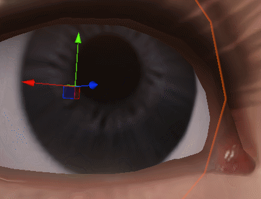

# 眼球效果

***

## 球极平面投影反射图
使用内存小的采样更快的2D图像完成模拟反射图的效果

|| |


**更小的畸变**

```c#
half3 Reflect(float3 reflectDir, half roughness, half nv)
{
     float m = 2.0 * sqrt(
        reflectDir.x * reflectDir.x + 
        reflectDir.y * reflectDir.y + 
        (reflectDir.z + 1.0) * (reflectDir.z + 1.0)
    );// 双球面映射形式的变种，我们只关心正半球图像
    m = max(m, 0.0001);// 保证缩放uv时不除0

    float2 uv = -reflectDir.xy / m + 0.5;

    half3 reflect = SAMPLE_TEXTURE2D_LOD(_EnvMap, sampler_EnvMap, uv, roughness * 8).rgb;
    reflect *= KarisApprox(roughness, nv) * _EnvIntensity;
    return saturate(reflect);
}
```

## 圆锥折射视差

相较于多次采样的视差，该效果只需要2次采样贴图（巩膜、虹膜）

|多层视差|无视差| 圆锥折射视差 |

通过折射向量和模型坐标，计算虹膜和巩膜的平面交点，根据交点返回所在物体空间坐标当作uv使用，该uv被交点与模型坐标的距离长度缩放以达到不同视角下的uv偏移，没有交点则使用一个固定值。

**代码均来自HDRP**
```c#
// 执行顺序伪代码
// rgb巩膜 a虹膜遮罩
half4 sampleRes = SAMPLE_TEXTURE2D(_BaseMap, sampler_BaseMap, i.uv);

float3 refractedPositionOS = CorneaRefraction(posOS, viewDirOS, normalize(posOS), corneaIOR, irisPlaneOffset);
float2 irisUV = refractedPositionOS.xy / max(irisRadius, 0.0001) * 0.5 + 0.5;

// 用于解决视差后的虹膜uv在边界看到巩膜内容
float2 animatedIrisUV = CirclePupilAnimation(irisUV, pupilRadius, pupilAperture, minimalPupilAperture, maximalPupilAperture);

// 合并两个颜色
sampleRes.rgb = lerp(sampleRes.rgb, irisSampleRes.rgb, sampleRes.a);
```

***

[back](../../coding-page.html)