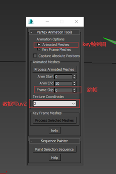
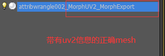
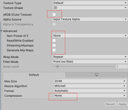

# 顶点动画烘焙到图
有时候需要一些流体或者顶点动画，而如果存成animation或者abc文件 数据将会过大。
虚幻4提供了一种烘焙动画数据到贴图的方法，我们首先找到提供的脚本
位置：…\Engine\Extras\3dsMaxScripts中的VertexAnimationTools.ms

1、拖入Max中我们制作好的动画场景

2、设置完点击process animated meshs会生成下图后缀mesh和exr格式动画图片
Uv2信息在这个mesh中导出fbx到工程

3、图片设置（andriod设置里也是关闭压缩）
Filter Mode: point

在shader中我们拿到uv2数据，使用uv2.x坐标寻址，使用time驱动动画对这张动画图片
采样(float2(uv2.x, _Time.y))，对采样结果进行缩小（0-0.1）作为位置赋值给positionOS。

顶点数据烘焙到uv的好处是可以省去顶点计算或者刷权重的一步，更加直观的调整首尾帧。

[back](../../coding-page.html)