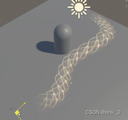
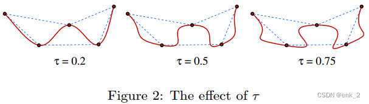
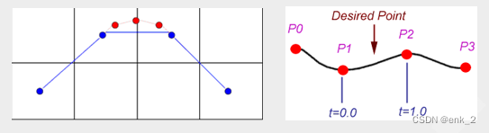
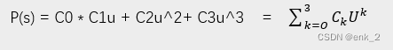
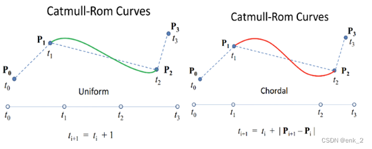
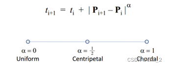
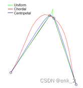

基于A*的寻路路径点生成，这里只做之后的显示以及曲线平滑
这里主要是Catmull-Rom的应用，最终选用的是[Centripetal Catmull–Rom spline](https://en.wikipedia.org/wiki/Centripetal_Catmull%E2%80%93Rom_spline)
点位计算有问题，请自行修改





起初想要通过[贝塞尔曲线](https://blog.csdn.net/u012154588/article/details/98977717)去平滑路径，但是很快便发现路径平滑后它不穿过中途点。

|  |  |  |  |






由最少4个点进行差值计算，差值结果在p1-p2之间

曲柄是由P'(0) = τ(P<sub>i</sub> - P<sub>i-2</sub>), P'(1) = τ(P<sub>i + 1</sub> - P<sub>i - 1</sub>)







这张图解释了不选用默认样条的原因


```csharp
//获取lilneRenderer组件并初始化
void GetLineRenderer()
    {
        
        if (_lr == null){Debug.Log($"{this.transform.name}: line renderer 获取失败");return;}

        if (lineMat == null){Debug.Log("line renderer材质不能为空");return;}

        //line renderer 设置;
        _lr.materials = lineMat;
        _lr.useWorldSpace = true;
        
        //颜色渐变，linerenderer会赋值给顶点色
        _lr.colorGradient = gradient;
        _lr.shadowCastingMode = ShadowCastingMode.Off;
        _lr.lightProbeUsage = LightProbeUsage.Off;
        _lr.reflectionProbeUsage = ReflectionProbeUsage.Off;
        _lr.textureMode = LineTextureMode.RepeatPerSegment;
        _lr.alignment = LineAlignment.TransformZ;
        _lr.widthCurve = width;
        _lr.useWorldSpace = true;

    }

 //这步可省略，可以在inspector里手动设置
 private Gradient GetColorGradient()
    {
        var g = new Gradient();   
        // Populate the color keys at the relative time 0 and 1 (0 and 100%)
        var colorKey = new GradientColorKey[4];
        colorKey[0].color = Color.black;
        colorKey[0].time = 0.1f;
        colorKey[1].color = Color.white;
        colorKey[1].time = 0.2f;    
        colorKey[2].color = Color.white;
        colorKey[2].time = 0.8f;  
        colorKey[3].color = Color.black;
        colorKey[3].time = 0.9f;
        var alphaKey = new GradientAlphaKey[1];
        alphaKey[0].alpha = 1.0f;
        alphaKey[0].time = 0.0f;

        g.SetKeys(colorKey, alphaKey);
        return g;
    }
    
private void SetPath()
    {
        transform.localRotation = Quaternion.Euler(new Vector3(0,0,0));

		//高度控制
        for (int i = 0; i < _pathArray.Count; i++)
        {
            _pathArray[i] += Vector3.up * height;
        }
        
        _lr.enabled = true;
        //将传入的寻路点输入，生成平滑点,smooth越高，差值出的平滑点越多
        _pathArray = GetCurve(_pathArray, smooth);
  
        _lr.positionCount = _pathArray.Count;
        for (int i = 0; i < _pathArray.Count; i++)
        {
            _lr.SetPosition(i, _pathArray[i]);
        }
        
        //需要将立面旋转为平面
        transform.localRotation = Quaternion.Euler(new Vector3(90,0,0));
        
    }
    
 	//根据输入点重新分布并平滑曲线点
    List<Vector3> GetCurve( List<Vector3> pathArray, int smooth = 4)
    {
        if (pathArray.Count < 3)
        {
            return pathArray;
        }
        List<Vector3> pathss = new List<Vector3>();
        CatmullRomCurve curve;
        Vector3 pt, p0, p1, p2, p3;

        for (int i = 0; i <= pathArray.Count - 2; i++)
        {
            p1 = pathArray[i];
 
            p0 = i == 0 ? p1 : pathArray[i - 1];
            p2 = pathArray[i + 1];
            p3 = i == pathArray.Count - 2 ? p2 : pathArray[i + 2];
            curve = new CatmullRomCurve(p0, p1, p2, p3, 0.5f);
            int detail = smooth;
            
            for( int j = 1; j < detail; j++ ) {
                float t = j / ( detail - 1f );
                pt = curve.GetPoint( t );
                pathss.Add(pt);
            }
        }

        return pathss;
    }

 //https://en.wikipedia.org/wiki/Centripetal_Catmull–Rom_spline
    public struct CatmullRomCurve {

        public Vector3 p0, p1, p2, p3;
        public float alpha;

        public CatmullRomCurve( Vector3 p0, Vector3 p1, Vector3 p2, Vector3 p3, float alpha ) {
            ( this.p0, this.p1, this.p2, this.p3 ) = ( p0, p1, p2, p3 );
            this.alpha = alpha;
        }

        // Evaluates a point at the given t-value from 0 to 1
        public Vector3 GetPoint( float t ) {
            // calculate knots
            const float k0 = 0;
            float k1 = GetKnotInterval( p0, p1 );
            float k2 = GetKnotInterval( p1, p2 ) + k1;
            float k3 = GetKnotInterval( p2, p3 ) + k2;

            // evaluate the point
            float u = Mathf.LerpUnclamped( k1, k2, t );
            Vector3 A1 = Remap( k0, k1, p0, p1, u );
            Vector3 A2 = Remap( k1, k2, p1, p2, u );
            Vector3 A3 = Remap( k2, k3, p2, p3, u );
            Vector3 B1 = Remap( k0, k2, A1, A2, u );
            Vector3 B2 = Remap( k1, k3, A2, A3, u );
            return Remap( k1, k2, B1, B2, u );
        }

        static Vector3 Remap( float a, float b, Vector3 c, Vector3 d, float u ) {
            return Vector3.LerpUnclamped( c, d, ( u - a ) / ( b - a ) );
        }

        float GetKnotInterval( Vector3 a, Vector3 b ) {
            return Mathf.Pow( Vector3.SqrMagnitude( a - b ), 0.5f * alpha );
        }

    }


//移除角色身后的路径点
 void PlayerMovingForward()
    {
        if (playerPos == null || _lr == null || _lr.positionCount == 0 || _pathArray.Count == 0) return;
        
        Vector3 p1 = _lr.GetPosition(0);
        Vector3 p2 = playerPos.position;
        Vector3 dir = Vector3.Normalize(p1 - p2);
        var cross = Vector3.Cross(playerPos.right, dir);
        //>0 p1 在 p2 后面， <0 p1 在 p2 前面,移除身后点
        if (cross.y > 0)
        {
            if (_pathArray.Count == 0)
            {
                //0点后不再进行删除
                return;
            }
            _pathArray.RemoveAt(0);
            _lr.positionCount = _pathArray.Count;
            for (int i = 0; i < _pathArray.Count; i++)
            {
                _lr.SetPosition(i, _pathArray[i]);
            }
        }
    }
    
```


[back](../coding-page.html)