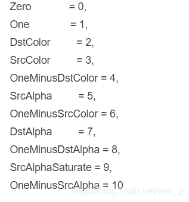

# Unity 动态修改模型Material实现遮挡半透
```csharp
public class TransparentMaterial : MonoBehaviour
{
    [Range(0,1)]public float alpha = 1;
    public Material sharedMat;

    private Renderer _renderer;
    private Material m;
    
    void Awake()
    {
        _renderer = GetComponent<Renderer>();
        //暂存原始数据
        sharedMat = _renderer.sharedMaterial;
    }

    private void Start()
    {
        EnableTransparent(alpha);
    }

    public void DisableTransparent()
    {
        _renderer.material = sharedMat;
    }

    public void EnableTransparent(float alpha = 0.5f)
    {
        if (alpha < 1f)
        {
            if (m == null)
            {
            //创建用来修改的mat
                m = new Material(sharedMat);
                m.name += "_Alpha";
            }
            //赋值
            _renderer.material = m;
            //设置Keyword到shader开启相关分支,或者这一步直接替换对应功能shader
            m.EnableKeyword("_TRANS_ON");
            m.SetFloat("_testAlpha",alpha);
            //半透明队列
            m.renderQueue = (int)RenderQueue.Transparent+3;
            //混合模式
            m.SetFloat("_SrcBlend",5);
            m.SetFloat("_DstBlend",10);
            m.SetFloat("_ZWrite", 1);
        }
        else
        {
            DisableTransparent();
        }
    }
```




[back](../coding-page.html)