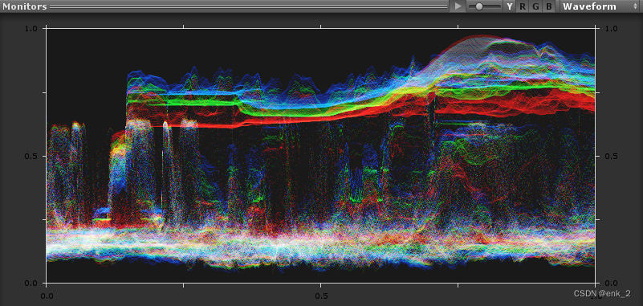
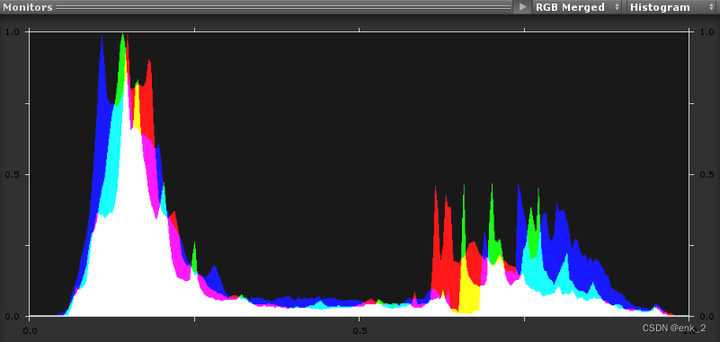
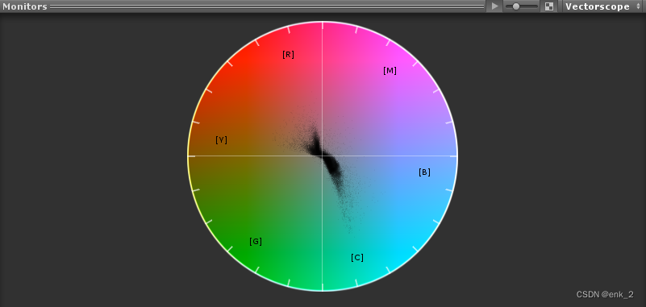
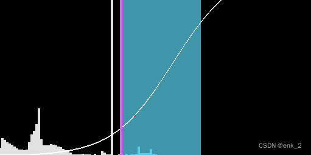
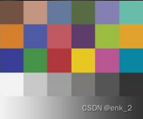
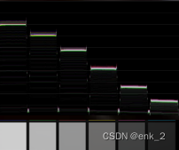
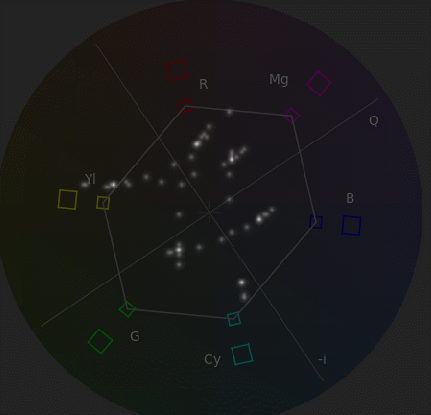
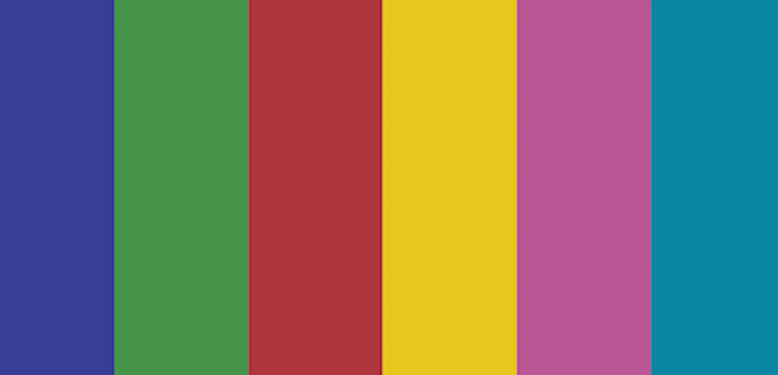
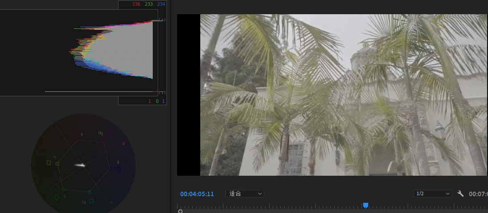
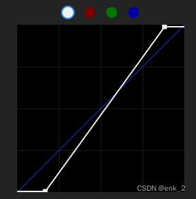

>程序同学有没有一种感觉，有时候看到游戏场景有一种难以言表的不舒服，但是又不知道画面到底为什么不舒服。
>美术同学看到好的作品想要”借鉴“，但是又无从下手。那么下面这套工具将会非常适合进行画面分析以及画面仿色。
>让程序看懂画面信息，让美术有参照依据，双方都听得懂对方在画面表现上想要的是什么。

## 示波器

人眼对颜色的感知各不相同，比起仅仅看图像画面，经过示波器验证的色彩可以确保结果准确统一。 电影校色中因为素材机位、光照等不同因素造成画面信息各不相同，想要 统一画面进行校色就需要准确显示画面数据的工具。 游戏校色中我们可以用灯光与间接光完成基础配色和明暗关系，素材本身 颜色反应游戏场景需要表达的主题，校色属于润色作用（照顾低配），通 常营造同场景不同氛围的时候使用，通过以下工具可以量化画面信息，读懂画面差异。

### 波形示波器

水平轴是画面从左到右，垂直轴是IRE明亮度单元。 监视器将显示渲染中的全部范围的亮度信息。可以将其视为一种高级直方图（图像的每一列对应一个垂直 直方图） 我们可以通过波形示波器快速了解画面偏色和明亮度区域。 IRE IRE把视频信号的有效部分——视频完全黑色（黑电平）到视频完全白色（白电平）之间平分成100份，定 义为100个IRE单位，即0～100IRE。广播及视频信号亮度不能超过100IRE，风格化经验数值80为白7.5为黑，写实经验数值95为白5为黑，数字信 号没有限制但也请酌情参照电视标准。

### 直方图

横轴代表画面亮度范围黑→白，三个颜色分量分别在对应色阶的像素数量（黄→红绿重合，以此类推） 直方图通过绘制每个颜色强度级别的像素数来展示图像中的像素是如何分布的。此图形有助于确定图像是 否正确曝光（过曝和欠曝）。 直方图可以帮助您准确评估阴影、中间调和高光，并调整总体的图像色调等级。 直方图使用 RGB 值。每个通道的最小亮度值会作为数值反馈，显示在左侧，最大值显示在右侧。 过曝 一张严重过曝的画面，直方图右侧被直接切断，255的纯白亮度值那里含有非常多的像素。 欠曝 0值的纯黑区域有大量的像素存在，直方图的左侧切断。

### 矢量示波器

色轮用于测量图像中的色调和饱和度的整体范围。测量是相对于示波器的中心进行的（从中心向外测量饱和度， 更饱和的颜色可将图形的相应部分拉伸到更远的边缘，中心点代表绝对零饱和度） 我们可以通过矢量示波器统一场景色相饱和度，剔除杂色使画面更统一。 通过判断矢量示波器图的中间位置相对于绝对中心的居中情况，可了解图像中是否存在颜色不平衡问题。 如果矢量示波器图偏离中心，则其偏斜的方向可指示渲染中有色偏（色调）。

R:红，M:品，B:蓝，C:青，G:绿，Y:黄（R，Y中心区域为肤色）

### 测光表

用于测量画面中是增加还是降低曝光值，直方图为全屏亮度分布，曲线为tonemapping curve，蓝色区域是EV的最小最大参考范围（低于增加，高于降低），紫色竖线是compute shader根据直方图计算的当前画面平均亮度（Filtering可以过滤直方图min%，max%）。

## 色卡

说了示波器不得不提到色卡，我们的场景明度、色相、饱和度是否准确符合预期，就需要通过示波器监视色卡并还原色卡。

当我们的明度一栏怼到相机前且不被方向光直射或背光时（或unlit），我们可以在波形示波器中看到如下阶梯形状，当然因为tonemapping的缘故，我们的纯白色亮度在80（并不是100,tonemapping mode neutral），每条线段抛去误差基本等于白色（RGB波形重合，没有色偏），这一步我们就完成了白平衡检验(不平衡，调色部分再说，一般是对资产校验)，各明度检验。

如果我们对于色彩的色相有严格要求，可以通过示波器对色卡的色相进行校准（后处理曲线调整，色相与色相）

Pr 适量示波器演示，杂点是色块交界处误差）

如果是真彩的范围还需要把饱和度各自降到安全框到原点一半的位置（风格化项目忽略），线性工程neurtal可以认为是无色偏（可省略此步骤，对外部材质校准即可‘列：扫描材质’）。

使用Neurtal 曲线映射的画会比较灰，这是因为曲线将亮度信息映射到了一个理想曝光状态

那么相对的，如果我们想要还原到人眼曝光范围(风格化)，可以通过示波器找回黑白场信息（后处理，曲线调整YRGB中的Y曲线，这里Pr-Y曲线会相应的修改饱和度，需要注意）

到这里我们的一个基础，美术想要的理想状态场景使用示波器校准完毕。

[back](../coding-page.html)