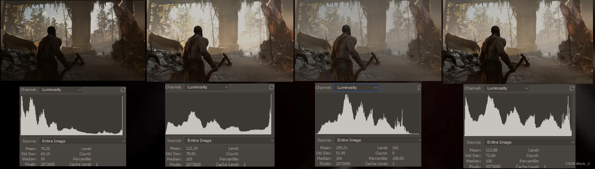
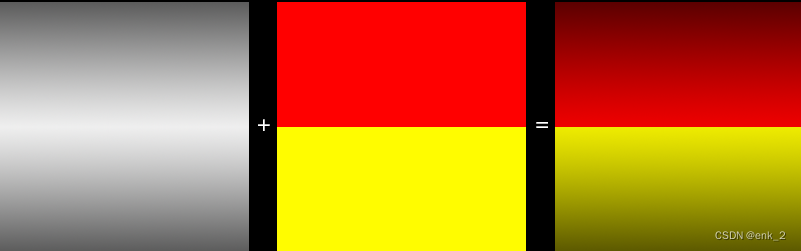
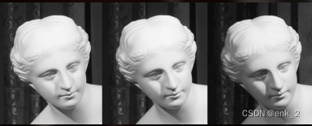
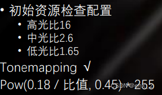
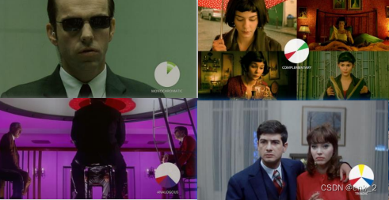

前篇我们对场景六基色色相和白平衡还有明度进行了验证，对黑白场做了微调。后面我们还需要对场景调光。

本篇主要涉及一些画面美术知识，不感兴趣可以跳过。

我们需要先了解一个摄影知识

## 曝光

下面要说到一种颜色模式HSB，HSB分别表示：

H(hues)表示色相

S(saturation)表示饱和度

B（brightness）表示亮度

曝光度（在没溢出时）----在一个颜色值里饱和度不变，亮度变化。也就HSB模式，B值变化（偏线性变化）。

[参考](https://www.zhihu.com/question/263561970/answer/273922231)

曝光信息可以用直方图进行数据量化展示

曝光的正确与否是主观的，这取决于画面想要表达的东西

图1    洞穴中曝光不足存在大量暗色区域 

图2    经过粗略曝光矫正，洞穴中暗部细节稍好，但外部过曝 

图3    是一个理想曝光状态（理想状态并不一定代表正确，印证第一句话，是否正确取决于我们主观决定） 

图4    是曝光基础上，人为修色调曲线的结果，更接近电影色调曲线                    [参考链接](https://bartwronski.com/2016/08/29/localized-tonemapping/)

曝光信息表示了场景当前亮度分布，我们可以直观的看出，左1图例低调信息堆积，中间调和高调信息缺失，图3低调高调信息稍少，中间调信息丰富而画面呈灰，而图4中画面重要信息‘角色’曝光信息丰富，场景变化和谐。

## 影调

明暗+色相=影调

影调应尽早确立，这关乎整个游戏或关卡的风格

影调的基本作用

 • 创造色彩、光线效果，构成画面色彩和黑白的基调。

 • 准确表现主体。影调的准确表现会大大加强画面的表现力。

 • 渲染气氛，体现个性与风格。

例如： 

• 高调——阳光、温馨 

• 中调——唯美、平静 

• 低调——神秘、大气

[参考链接](https://mp.weixin.qq.com/s/mVhheqpmk3O3xra6I64upg)

### 光比与影调

明面与暗面受光量差不多、亮度相近，光比就小，影调（或色调） 表现的反差也小，看来就觉得柔软（若运用不当，会觉得平淡）。 

• 明暗面的亮度相差较多，光比就大，影调（或色调）反差也大， 显得刚强（若运用不当，则会觉得僵硬）。 

• 光比很大，影调以黑白两极为主，中间的灰度很少，即为高反差 效果。 

• 光比很小，影调以灰为主，缺乏必要的黑白反差，就流于严重偏 灰的不良影调

我们可以使用经验光比来进行材质检查（人眼曝光中：测光板中性灰度是0.18，地板和球体的材质灰度实际是约等于RGB117）

## 配色

颜色可以影响感情，甚至身体上的感觉，色彩能够建立和谐或矛盾，并让我们关注主题。 尽管颜色运用是约定俗成的，但并不是一成不变，没有铁律。 

• 单色调 

    • 单色调一般由单一颜色的不同色调产生。 

• 互补色 

    • 对立的喜戏剧效果。色轮上，互补色位置相反。 

• 相似色 

    • 在色轮上相互临近，可选一种作为主要色，一种为支撑，另一种来加强。 

• 三色 

    • 色轮上分布均匀，色彩艳丽，充满活力。一种占主导，其他来加

[链接](https://www.studiobinder.com/blog/how-to-use-color-in-film-50-examples-of-movie-color-palettes/)

项目初期，对各个关卡调光，由统的一美术基调细分出各自的情感倾向，（调光的过程也是项目美术资产色盘的原始积累，我们可以先用素模大色块快速搭建整体氛围，确保场景内所用资产色相符合预期并且范围可控、可通过矢量示波器校验）。

[拾色色盘小工具推荐Adobe](https://color.adobe.com/zh/create/color-wheel)   

[back](../coding-page.html)