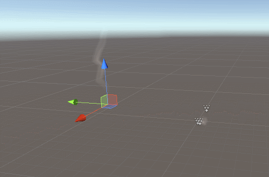
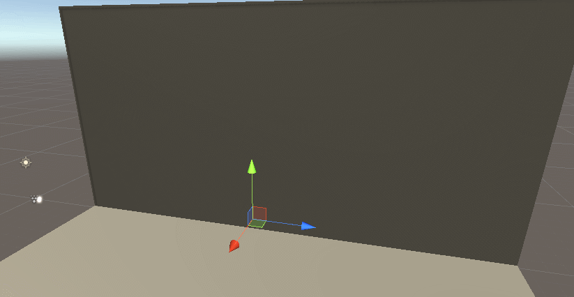
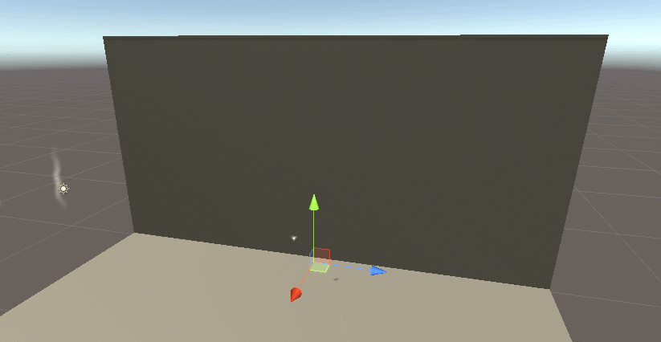

# Unity中利用Line Renderer || Trail Renderer 制作飘烟拖尾

>在Unity中粒子特效就可以制作飘烟拖尾，但是如果运动过快难免会有不自然的断开。虽然粒子中加入了Trail，但是我让拖尾转角圆滑比较困难（这方面还得请教特效同学）。当然如果对转角没有要求，粒子还是最简单的。

粒子拖尾效果:


Line Renderer拖尾


我们在unity中创建gameobject，添加line renderer组件。

我们的目的是为line添加轨迹点坐标，让line随时间上升。

```ruby
//获取组件
lineRenderer = gameObject.GetComponent<LineRenderer>();
//设置transform
tr = this.transform;


float timeSinceUpdate = 0.0f;
float updateSpeed = 0.025f;
//在update中我们用笨办法限制记录轨迹的间隔
timeSinceUpdate += Time.deltaTime; // 新时间

    
// 线段更新了
if (timeSinceUpdate > updateSpeed)
{
    timeSinceUpdate -= updateSpeed;

    //设一个最大轨迹点数
    if (point < pCount)
    {
        list.Add(tr.position);

    } 
    
}

if (list.Count>0)
{
    //这里是简单的上升动画，为每一个line点赋值
    for (i = 0; i < list.Count; i++)
    {

        list[i] += new Vector3(0, upSpeed, 0) * Time.deltaTime;
        
    }

    drawBezierCurve();
}


private void drawBezierCurve()
{
    
    List<Vector3> bcList;
    BezierPath bc = new BezierPath();

    bcList = bc.CreateCurve(list);//  通过贝塞尔曲线 平滑
                                    //	Debug.Log(bcList.Count + " " + list.Count);

    //bcList = CreateCurve(list);//  通过贝塞尔曲线 平滑
    if ( point < pCount)
    {

    lineRenderer.positionCount = bcList.Count;
    }
    //	Debug.Log(bcList.Count);
    for (int i = 0; i < bcList.Count; i++)
    {
        Vector3 v = bcList[i];
        //v += new Vector3(0, 0.5f, 0);
        lineRenderer.SetPosition(i, v);
    }
    point = bcList.Count;
    

}

```

```ruby
//这里的曲线平滑是网上找的没有深入研究
using UnityEngine;
using System.Collections;
using System.Collections.Generic;

public class BezierPath
{


	public List<Vector3> pathPoints;
	private int segments;
	public int pointCount;

	public BezierPath()
	{
		pathPoints = new List<Vector3>();
		pointCount = 100;//最大点数
	}

	public void DeletePath()
	{
		pathPoints.Clear();
	}
	//t就是两点之间几分之几的位置
	Vector3 BezierPathCalculation(Vector3 p0, Vector3 p1, Vector3 p2, Vector3 p3, float t)
	{
		float tt = t * t;
		float ttt = t * tt;
		float u = 1.0f - t;
		float uu = u * u;
		float uuu = u * uu;

		Vector3 B = new Vector3();
		B = uuu * p0;
		B += 3.0f * uu * t * p1;
		B += 3.0f * u * tt * p2;
		B += ttt * p3;

		return B;
	}

	public List<Vector3> CreateCurve(List<Vector3> controlPoints)
	{
		segments = controlPoints.Count / 3;//以3为间隔进行平滑 算出分段数量
		pointCount = controlPoints.Count;//这里最大点数就是本身
		for (int s = 0; s < controlPoints.Count - 3; s += 3)//以3为间隔遍历所有点
		{
			Vector3 p0 = controlPoints[s];
			Vector3 p1 = controlPoints[s + 1];
			Vector3 p2 = controlPoints[s + 2];
			Vector3 p3 = controlPoints[s + 3];
			//第一个点的处理
			if (s == 0)
			{
				pathPoints.Add(BezierPathCalculation(p0, p1, p2, p3, 0.0f));
			}
			//
			for (int p = 0; p < (pointCount / segments); p++)
			{
				float t = (1.0f / (pointCount / segments)) * p;
				Vector3 point = new Vector3();
				point = BezierPathCalculation(p0, p1, p2, p3, t);
				pathPoints.Add(point);
			}
		}
		return pathPoints;
	}
}

```
到此line的跟随坐标路径做上升动画就完成了，想要添加其他动画可以在update中完成。

trail相比line 我们需要做的就简单多了。

```ruby
_trail = GetComponent<TrailRenderer>();
tr = this.transform;


_trail.emitting = true;


//update
 time += Time.deltaTime;
        if (time > VanishTime && !isOk)
        {
            StartCoroutine(starTime());
        }
       
        //t = Random.RandomRange(-0.5f,0.5f);
        if (_trail.positionCount > 0)
        {
            for (int i = 0; i < _trail.positionCount; i++)
            {
                var v = new Vector3();
                v = _trail.GetPosition(i);
                v += new Vector3(0, ascentSpeed, 0);
                //  v += new Vector3(Random.RandomRange(-0.1f,0.1f), ascentSpeed, Mathf.Sin(0.1f));
                _trail.SetPosition(i, v);
            }   
        }  
```
trail本身是可以在组件中设置更多参数的

严格来说这只是拖尾，至于是不是烟雾还是要靠材质球表现了


[back](../coding-page.html)