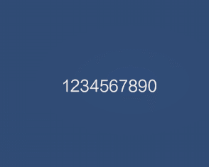

TextMeshPro（TMP）是unity的一套UI文字方案，支持对顶点、颜色进行编辑，自定义强，可扩展等优点。

对于英文数字即字符只需制作ASCII的文件即可，但是对于中文，如果我们的文字需要动态生成且不可控，那么就需要考虑所有可能需要的文字，生成的字体文件就会很大，不适合手游等要求安装包小的项目使用。所以建议只在可确定中文的UI和ASCII包含字符上使用Textmesh pro。


# 安装
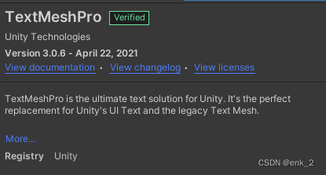

组件分为两类


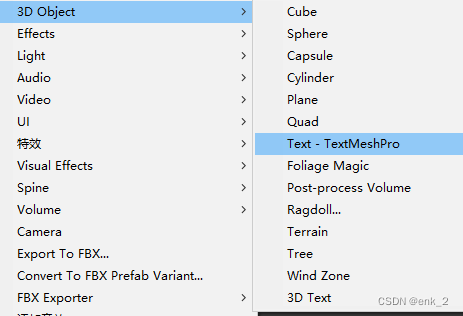
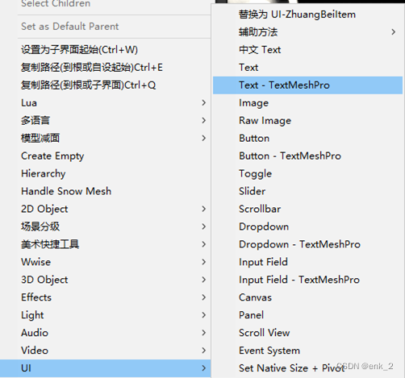

# 关于中文字体文字生成
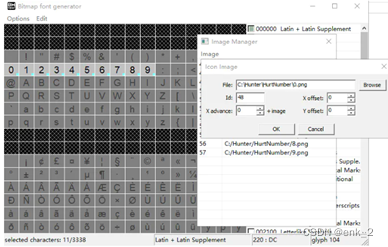
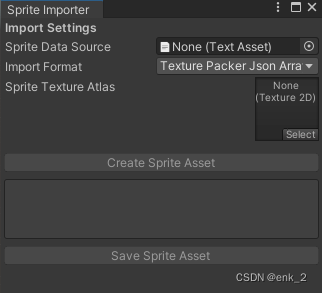

[BMPFont](https://www.angelcode.com/products/bmfont/)
位图按照内容命名依次导入文字位图，生成图集和.fnt字符信息
在unity读取字符信息生成字库


[TexturePacker](https://www.codeandweb.com/texturepacker)
位图同上操作导入，工具输出切分好的JSON(Array)信息
使用 Sprite Importer导入成字库


PS JS将图片按顺序分层排列，利用JS脚本导出每图层信息并组织成
字符信息，使用Sprite Importer导入成字库


[Unity Sprite](https://blog.csdn.net/weixin_44328367/article/details/106090185)
切割图集，脚本创建字符信息创建字库或Sprite Importer导入收集的信息
生成字库


## 例
Unity Sprite方式，需要读取位图信息和字符信息赋值到Font并保存
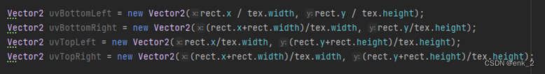
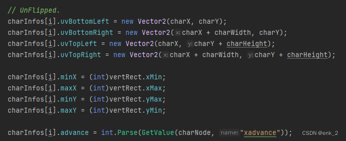
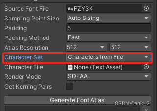

TMP 字体会生成SDF信息
Font 文件需要characterInfo、material (Transparent)
我们可以使用Characters From File来映射字体文件中的字符
[官网](https://docs.unity3d.com/Packages/com.unity.textmeshpro@4.0/manual/FontAssetsProperties.html)

生成好font文件后，我们使用TMP的Font Asset Creator生成TMP可用字体格式

我们也可以生成单独的字库文件追加到已有字库中

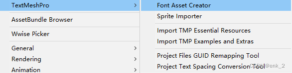
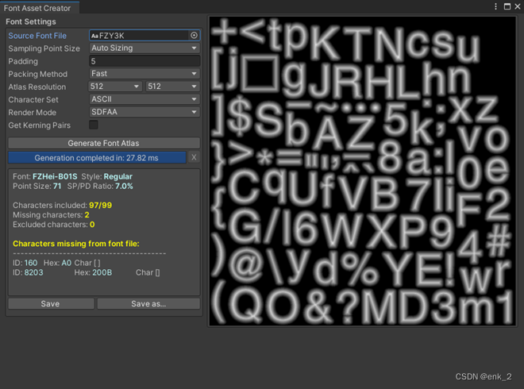
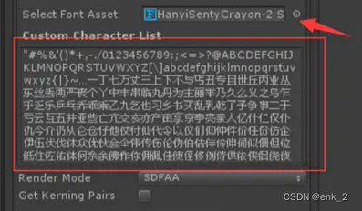

# 动画
[参考](https://www.bilibili.com/video/BV15U4y117zP/?vd_source=16325a6476127ffe372818b0134c05b3)
获取TMP_Text组件中的CharacterCount、verteices信息
对每字符进行操作

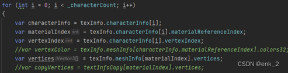

vertexIndex是字符mesh第一个顶点，vertices是所有顶点数据

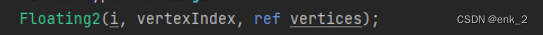

操作完对mesh刷新，传递到对应Renderer中


延迟更新

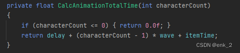

根据字符总数、延迟时间、单位时间计算出
最大时长，在循环模式中对time取余（elapsedTime=deltaTime）

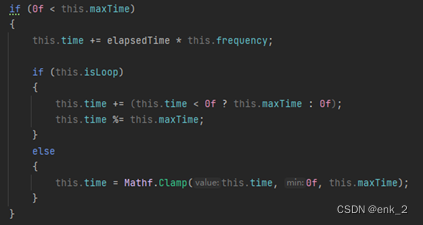
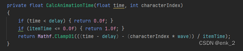

根据字符index和当前计算的时间读取动画曲线（可省略）

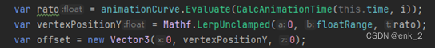

[参考](https://github.com/coposuke/TextMeshProAnimator)

文字Mesh，每个字符由4个顶点组成
顺序为				
左下、左上、右上、右下

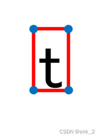

根据需要对顶点进行逐顺序驱动，本篇的浮动效果比较简单，直接4个顶点同时赋值即可

# 便捷实现
DoTweenPro，对就是这么便捷

# 补充
shader实现浮动文字动画[链接](http://sketchhousegames.com/blog/2020/make-unity-text-animation-easy-with-shaders/)

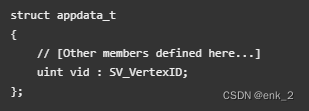

```c#
float _AnimationVerts[16]
```
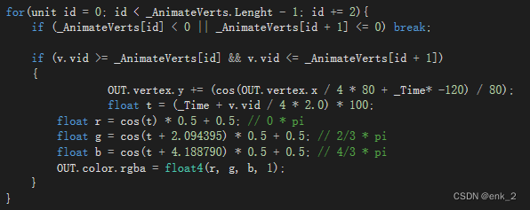

[back](../coding-page.html)